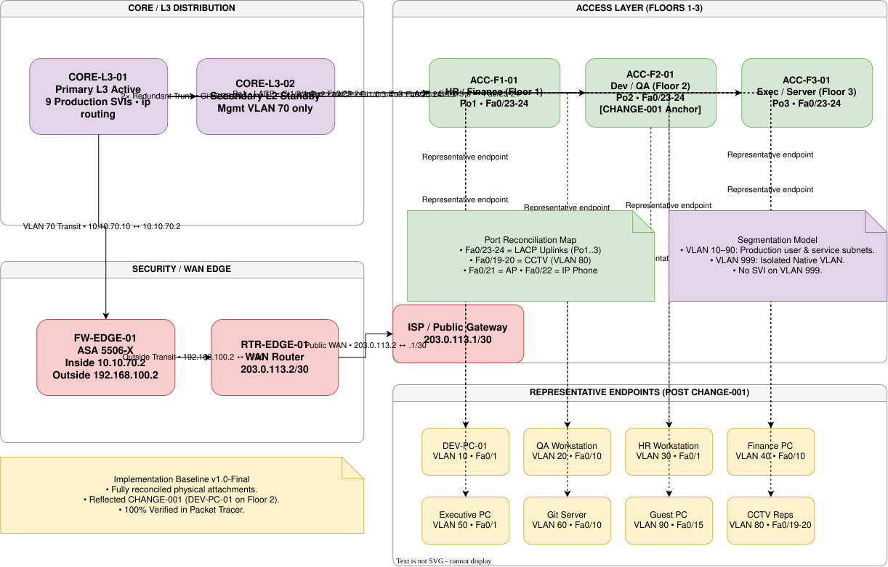
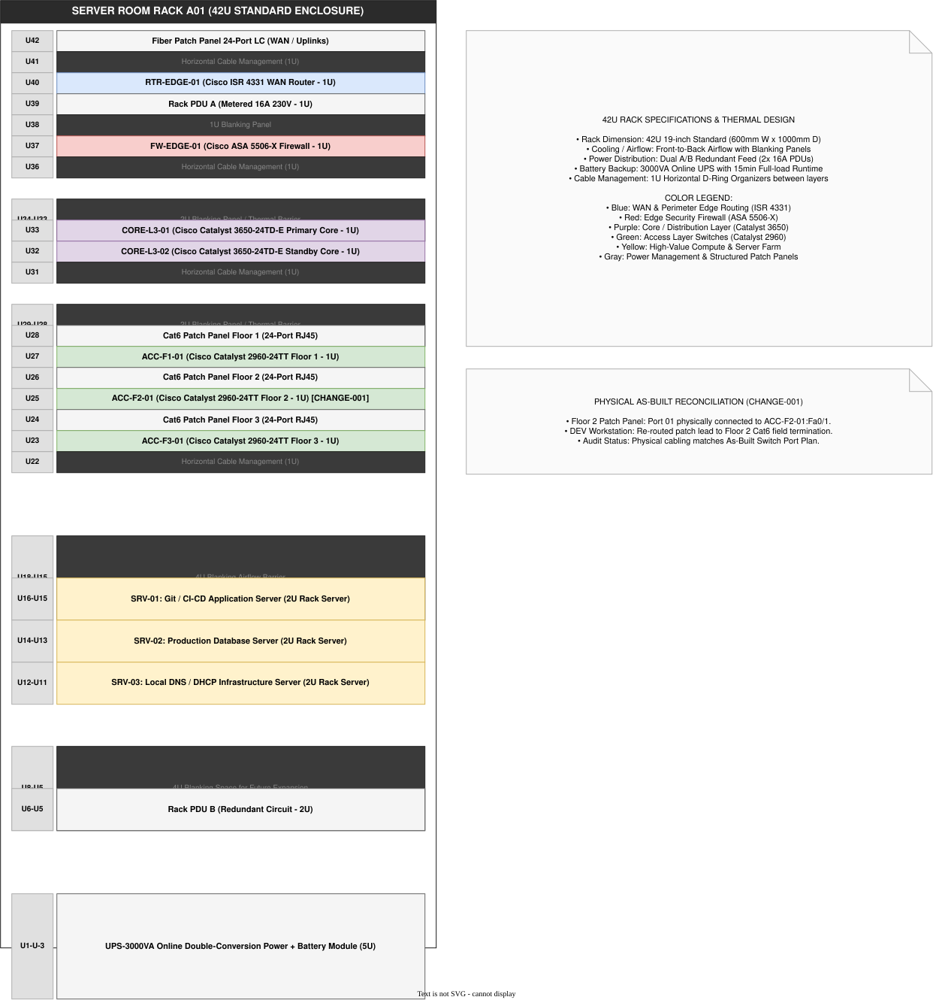
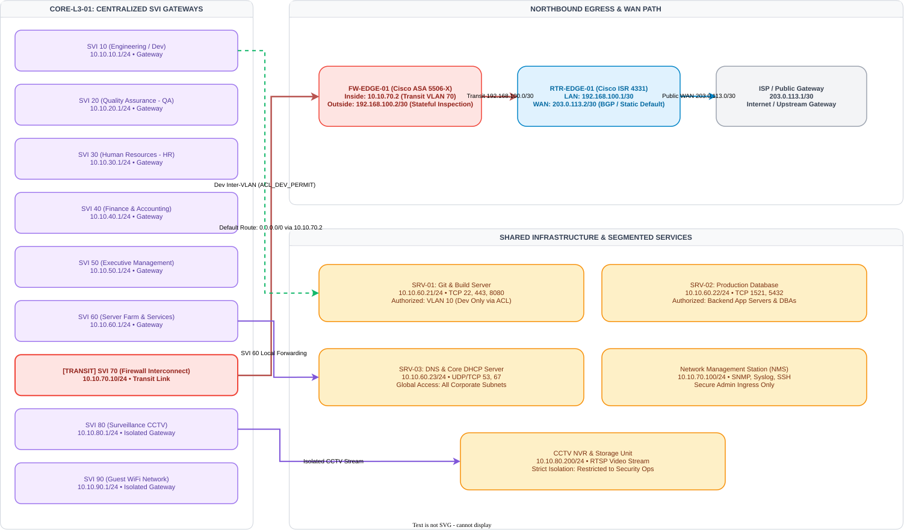
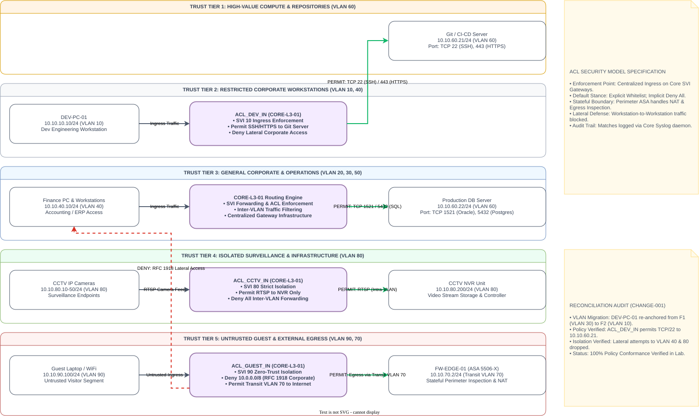
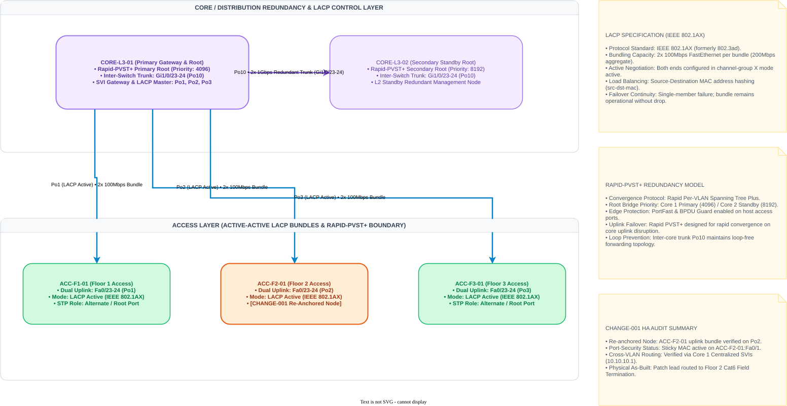

# Enterprise Network Infrastructure Blueprint


> **Status:** 🟡 `Final Data Consistency Review in Progress`  
> Core architecture, multi-tier implementation, validation evidence, and engineering documentation are undergoing final cross-document reconciliation before baseline freezing.

A vendor-neutral, validated enterprise network architecture blueprint designed, implemented, validated, and reconciled through a traceable Systems Engineering lifecycle. The system is engineered to solve multi-zone campus connectivity, Layer-2 resiliency, granular access control, and configuration assurance for a 150-user, three-floor SME enterprise environment.

---

## 🏛️ Project & Architecture Overview

This project presents a **validated enterprise network architecture blueprint** for **ABC Digital Solutions**.

The project follows a rigorous Systems Engineering approach from business requirements through architecture decisions, Cisco-based implementation, security controls, failure validation, change management, and As-Built documentation.

The objective is not simply to reproduce a classroom Packet Tracer topology, but to demonstrate a traceable engineering workflow in which infrastructure decisions are linked back to explicit market evidence and validated against defined failure scenarios.

### Core Architectural Capabilities

* **Layer 2 Foundations:** 9 Production VLANs (VLAN 10–90) and Native/Dead VLAN 999; Rapid PVST+ (`rapid-pvst`) deterministic root election; dual-link LACP active aggregation (`Port-channel1..3`); edge hardening via BPDU Guard, PortFast, DHCP Snooping, and Sticky Port Security.
* **Layer 3 Forwarding:** Centralized Switched Virtual Interface (SVI) routing on Catalyst 3650 (`CORE-L3-01`) eliminating Router-on-a-Stick bottlenecks, paired with a floating default static route (`0.0.0.0/0 via 10.10.70.2`) into the edge firewall transit zone.
* **Granular Security Controls:** Extended Access Control Lists (`ACL_DEV_IN`, `ACL_FIN_IN`, `ACL_HR_IN`, `ACL_GUEST_IN`) enforcing strict inter-zone traffic segregation and complete lateral isolation for the untrusted Guest Zone.
* **High Availability & Link Resiliency:** Validated sub-2-second STP re-convergence upon core link disruption and zero-packet-drop member link failover across LACP bundles.

> ### ⚠️ Version 1 Architecture Boundary
> Version 1 provides **Layer 2 and link-level resilience**, but does not implement active-active Layer 3 gateway redundancy.  
> `CORE-L3-01` operates as the sole active Layer 3 gateway, while `CORE-L3-02` provides Layer 2 secondary bridging and path redundancy. Failure of `CORE-L3-01` temporarily interrupts inter-VLAN routing.  
> This is an **explicitly accepted V1 architectural limitation**, with First-Hop Redundancy Protocols (HSRP/VRRP) formally retained as a Version 2 evolution milestone.

---

## 🛡️ Change Management & Audit Highlight

### Case Study: CHANGE-001 (Endpoint Physical Re-allocation & Port-Security)

During post-implementation verification, an endpoint allocation discrepancy was detected: `DEV-PC-01` (VLAN 10) was physically patched to Switch Floor 1 (`ACC-F1-01 / Fa0/1`) instead of Switch Floor 2 (`ACC-F2-01 / Fa0/1`).

```text
  [ DEVIATION DETECTED ] ──> [ SCOPE CONTROL ] ──> [ CONTROLLED EXECUTION ] ──> [ EVIDENCE RECONCILIATION ]
  DEV on Floor 1 (VLAN 30)    Frozen Core/Firewall  Relocate cable to Floor 2    100% Ping to Gateway/Git Srv
  Sticky MAC bound on F1     Limit to F1/F2 Ports  Clear Stale MAC on F1        Update Port Plan & As-Built Logs
```

* **Audit Trail & Ticket Record:** [`change-management/CHANGE-001/CHANGE-001-dev-endpoint-reconciliation.md`](./change-management/CHANGE-001/CHANGE-001-dev-endpoint-reconciliation.md)
* **Pre-Change & Post-Change Evidence:** [`change-management/CHANGE-001/`](./change-management/CHANGE-001/)

---

## 🏗️ Architecture Views

The network architecture is captured across 5 distinct engineering perspectives, preserved in native vector format (`.svg` / `.drawio`) for maximum clarity and traceability:

### 1. Logical Architecture *(Hero View)*
The primary 4-tier hierarchical topology illustrating core routing, distribution, edge security, and access layer segmentation.



---

### 2. Supporting Architecture Perspectives
<details>
<summary><b>🔍 Click to expand: Physical, Routing, Security & HA Views</b></summary>
<br>

#### 2.1 Physical Rack Layout & Cabling
Physical equipment allocation, cable labeling, and power redundancy across the 42U Server Room rack.



---

#### 2.2 Layer 3 Routing & Traffic Flows
Inter-VLAN packet flow paths between user workstations, centralized infrastructure services (DNS/DHCP `10.10.60.10`, Git Server `10.10.60.21`), and NAT Overload egress to ISP.



---

#### 2.3 Security Boundaries & Policy Enforcement Points
Trust Zone classification (Trust Levels 1–5) and ingress SVI Extended ACL policy filter boundaries.



---

#### 2.4 High Availability & Link Failover
LACP bundle member link degradation and Spanning-Tree Alternate Blocking-to-Forwarding (`Altn BLK` -> `Root FWD`) failover behavior.



</details>

---

## 🔬 Systems Engineering Golden Thread

This repository enforces strict bidirectional traceability from initial market evidence down to individual CLI configuration lines:

```text
  [ Market Evidence ]        157 Market JDs + Cisco CVD Frameworks
          │
          ▼
  [ Requirements ]           Functional (FR), Security (SR), Availability (AR) Specs
          │
          ▼
  [ System Analysis ]        13 IT Asset Valuations & 5 Security Trust Zones
          │
          ▼
  [ Architecture & ADRs ]    Architecture Decision Records (ADR-001 through ADR-005)
          │
          ▼
  [ Network Design ]         Physical Topology, Subnet Allocation & L2/L3 Plans
          │
          ▼
  [ Implementation ]         7 Reconciled Cisco Configuration Baselines
          │
          ▼
  [ Governance & Change ]    CHANGE-001 Remediation & Pre/Post Audit Logs
          │
          ▼
  [ Chaos Testing ]          12-Phase Failure Injection & Link Disruption Tests
          │
          ▼
  [ Verification ]           Raw CLI Evidence Logs & As-Built Engineering Report
```

---

## 🧪 Validation & Chaos Testing Summary

The entire infrastructure underwent a rigorous 12-Phase acceptance test cycle within Cisco Packet Tracer. The system achieved a **94.4% overall validation pass rate**, with all expected architectural behaviors and simulator boundaries documented.

| Testing Domain | Target Phase | Status | Key Engineering Observation |
| :--- | :---: | :---: | :--- |
| **Topology, IP Plan & Trunking** | Phase 1–4 | 🟢 PASS | 9 VLANs operational; Dot1Q trunking active across Core-Access uplinks. |
| **EtherChannel & STP Convergence** | Phase 5–8 | 🟢 PASS | LACP Po1..3 status (SU); Rapid PVST+ converged with deterministic root bridge. |
| **L3 Inter-VLAN & Egress Routing** | Phase 9 | 🟢 PASS | Centralized SVI routing verified; 100% ICMP reachability across internal subnets and egress. |
| **Security & Extended ACL Policy** | Phase 10 | 🟡 LIMITATION | Policy logic validated (PASS). SVI binding parser issue identified as Packet Tracer simulator bug. |
| **STP Link-Down Re-convergence** | Phase 11.1 | 🟢 PASS | CORE-L3-02 alternate port Gi1/0/24 transitioned from Altn BLK to Root FWD in <2s. |
| **LACP Single-Link Degradation** | Phase 11.2 | 🟢 PASS | Port-channel remained up Po1(SU) after Fa0/23 shut down; zero traffic drop on Fa0/24(P). |
| **Active Core Gateway Failure** | Phase 11.3 | 🟡 PARTIAL | Documented expected Single-Gateway behavior (Active-Passive L2 redundancy model; L3 routing paused). |
| **System Auto Re-convergence** | Phase 11.4 | 🟢 PASS | Core 1 recovered; Spanning-Tree and SVI Gateways returned to baseline state automatically. |

> Detailed test case definitions and acceptance logs are available in the [Validation Report](./docs/04_validation/validation_report.md) and [Raw Verification Logs](./implementation/verification/).

---

## ⚠️ Known Limitations

The following limitations are explicitly documented as part of the Version 1 engineering baseline:

1. **Layer 3 Gateway Redundancy:** `CORE-L3-01` serves as the sole active Layer 3 default gateway. First-hop routing redundancy via HSRP/VRRP is deferred to Version 2.
2. **Packet Tracer ACL Binding Behavior:** Extended ACL syntax and policy logic are verified, but Packet Tracer Catalyst 3650 parser exhibits a known limitation preventing `running-config` commitment on SVI ingress.
3. **Simulation Modeling Boundary:** Test results represent a modeled Cisco Packet Tracer environment and should not be interpreted as physical hardware production certification.

---

## 📂 Navigation Gateway

Detailed project documentation is structured into 5 formal chapters and supporting engineering datasets:

* 📚 **Chapter 1 — Requirements Discovery:** [`docs/01_requirements_discovery/`](./docs/01_requirements_discovery/)  
  *(Market JDs quantitative analysis, keyword frequency, qualitative insights, and scope boundary definitions)*
* 🏛️ **Chapter 2 — System Architecture & Analysis:** [`docs/02_analysis/`](./docs/02_analysis/)  
  *(Business context, asset classification AST-01..13, trust zones, system requirements, and ADRs)*
* 📐 **Chapter 3 — Detailed Network Design:** [`docs/03_network_design/`](./docs/03_network_design/)  
  *(Subnet planning, L2/L3 design specs, extended ACL matrices, HA design, and modular CLI SOPs)*
* 🧪 **Chapter 4 — Test & Validation Strategy:** [`docs/04_validation/`](./docs/04_validation/)  
  *(15 Test Cases specifications, 12-phase acceptance report, and simulator constraint analysis)*
* 💡 **Chapter 5 — Engineering Reflection & Roadmap:** [`docs/05_reflection/`](./docs/05_reflection/)  
  *(Lessons learned, architectural trade-offs, and 3-stage scale-up roadmap: HSRP/VRRP, NGFW, and EVE-NG)*
* 🛡️ **Change Management Records:** [`change-management/`](./change-management/)  
  *(CHANGE-001 audit record, before/after evidence logs, and blast radius assessments)*

---

## 🛠️ Engineering Artifacts & Quick Links

* **7 Reconciled Cisco Configuration Baselines:** [`implementation/configs/`](./implementation/configs/)
* **Master Packet Tracer Simulation:** [`packettracer/enterprise_network_v1.0.pkt`](./packettracer/enterprise_network_v1.0.pkt)
* **Raw CLI Verification Evidence:** [`implementation/verification/`](./implementation/verification/)
* **Automated Audit & Traceability Scripts:** [`validation/`](./validation/)
* **Final Engineering Report:** [`deliverables/Enterprise_Network_Infrastructure_Blueprint_v1.0.pdf`](./deliverables/Enterprise_Network_Infrastructure_Blueprint_v1.0.pdf)

---

## 📜 License

This project is open-source and distributed under the MIT License. See the [`LICENSE`](./LICENSE) file for complete details.